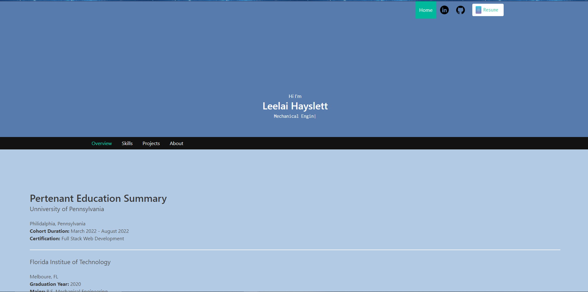

# Leelai Hayslett's Portfolio

## Portfolio info

This portfolio showcases all of the applications that Leelai has created through the LPS Penn web-developing program. As my knowledge expands the website application will be more interactive and expressive of who I am as a developer. I hope to convert my web-development skills to software development and eventually game development. Thank you for taking the time to watch my portfolio progression!

## Website

https://leelaihayslettportfolio.netlify.app

## Github Link

https://github.com/Leelai064/LHPorfolio

## Website Visuals

## Liscense 

MIT
Bootstrap